# Umbrage

[English](./README.md) | [Русский](./README_ru.md)

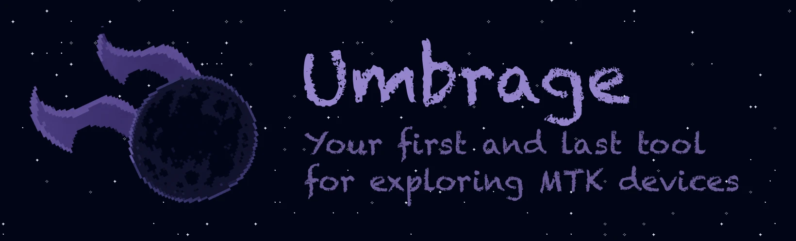

Umbrage is a cross-platform GUI tool for working with MediaTek SOC-based devices, built on top of the [penumbra](https://github.com/shomykohai/penumbra) core.

The project aims to make routine and complex tasks such as bootloader unlocking or flashing as simple and accessible to everyone as possible, eliminating the need to deal with the terminal and scripts.

The main goal of the project is to create an open and strong alternative to existing paid utilities, which will constantly evolve thanks to community support and contributions.

## Features

### Step-by-step and minimalist UX

Unlike classic bulky GSM tools, overloaded with a thousand buttons and unnecessary elements on screen, Umbrage focuses on a clean interface.

The process is built sequentially: the app hides everything irrelevant at the current stage and guides the user through the steps - for example, sequentially requesting the required files _(DA -> AUTH -> PRELOADER)_.

<div style="display: flex; flex-wrap: wrap;">
    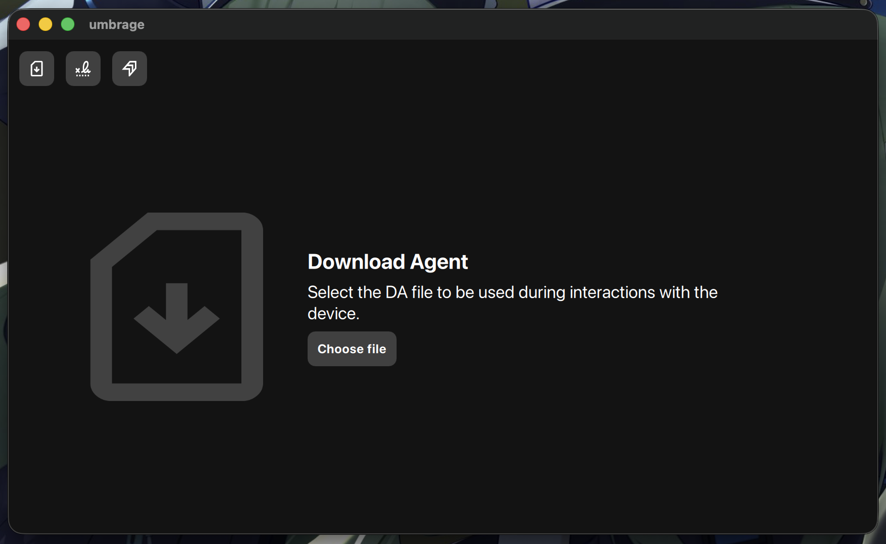
    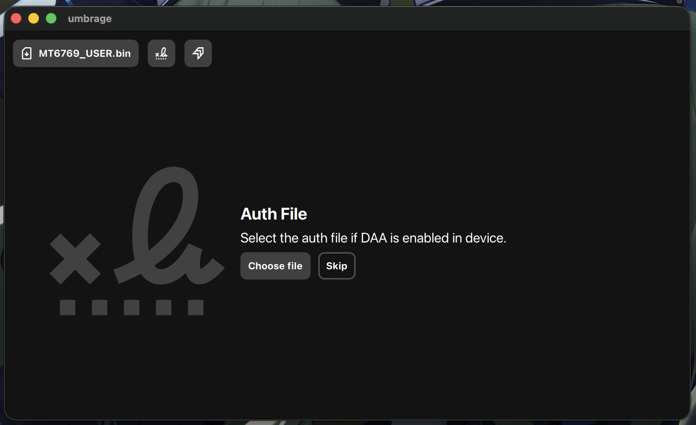
    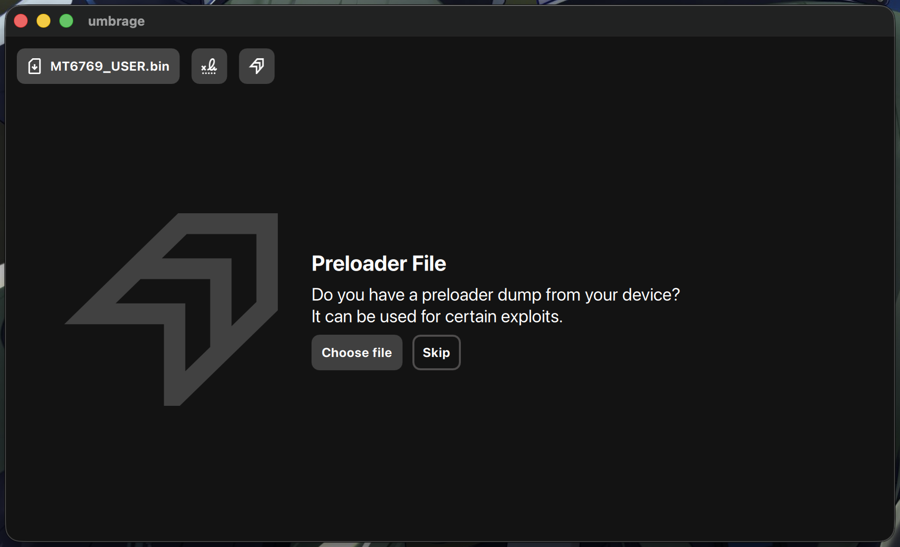
</div>

### Community templates

Why spend a long time searching for files on the internet when you can use the Umbrage user repository?

It contains a huge database of DA, AUTH, and PRELOADER files, neatly sorted by device and verified by the community. Just specify your device model and pick one of the ready-made templates.

> It works exactly like paid GSM tools, but way cooler, more flexible, and completely free!

<div style="display: flex; flex-wrap: wrap;">
    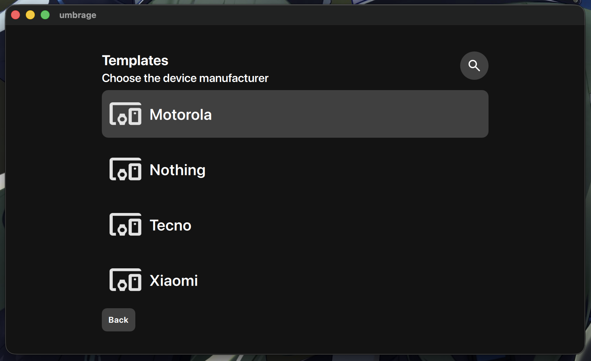
    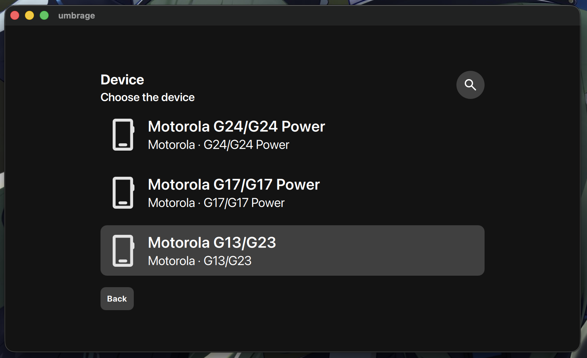
    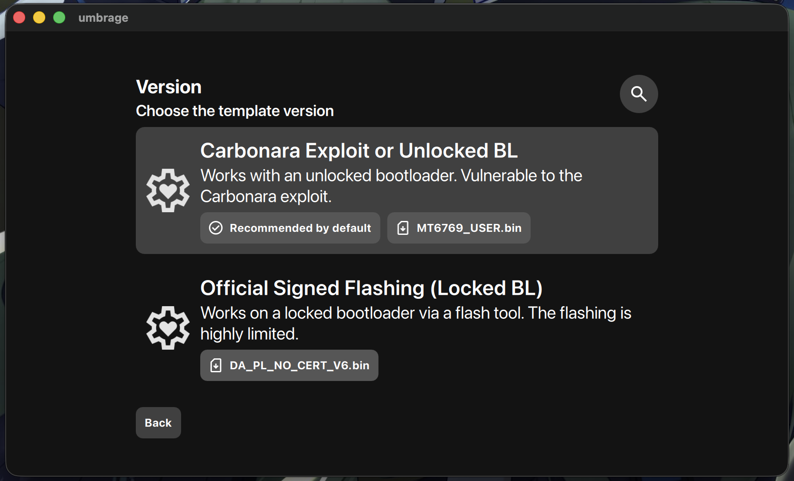
</div>

### Bootloader unlocking

Umbrage uses the [penumbra](https://github.com/shomykohai/penumbra) core as its backend, so all supported exploits (karbonara, kamakiri, HeapB8, etc.) are available right out of the box.

This allows unlocking the bootloader on vulnerable devices with a single click.

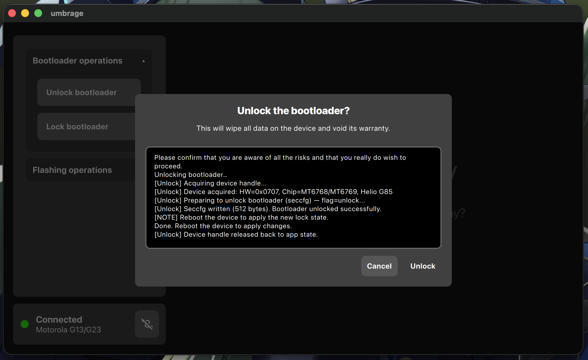

### Writing/Dumping device partitions

Umbrage provides a convenient tool for working with device memory, allowing you to back up (dump) and write individual partitions in just a few clicks.

<div style="display: flex; flex-wrap: wrap;">
    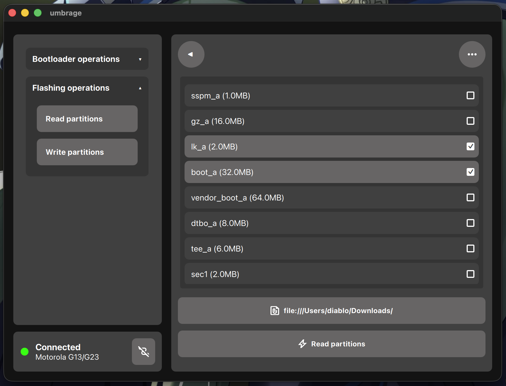
    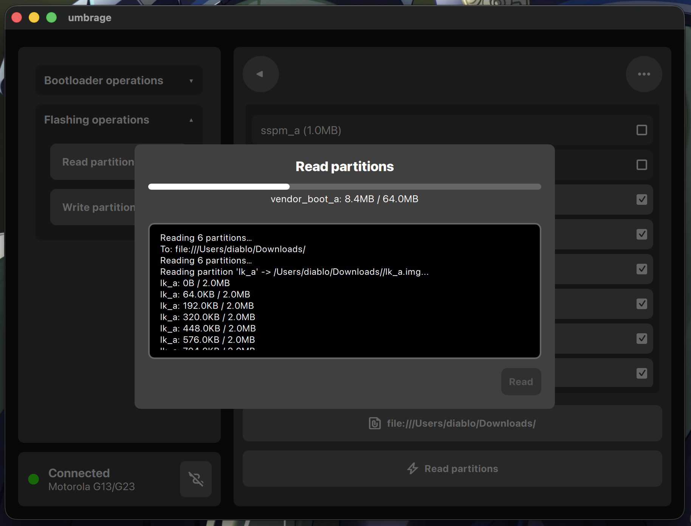
</div>

### Scatter file support

Use the same scatter files and instructions as in SP Flash Tool, straight in Umbrage!

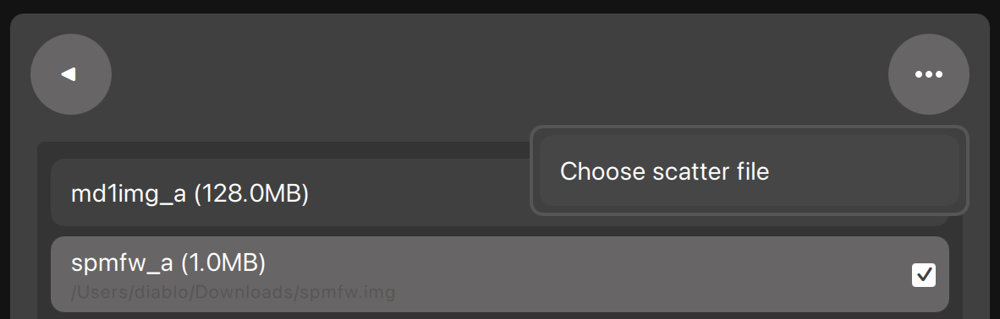

## Installation

### Linux

Download the [latest release](https://github.com/progzone122/umbrage/releases), run Umbrage in the terminal and simply follow the on-screen instructions!

```shell
./umbrage-linux.AppImage
```

### macOS

1. Install qt6

```shell
/bin/bash -c "$(curl -fsSL https://raw.githubusercontent.com/Homebrew/install/HEAD/install.sh)" && brew install qt
```

2. Download the [latest release](https://github.com/progzone122/umbrage/releases), run Umbrage in the terminal **with elevated privileges** and simply follow the on-screen instructions!

```shell
sudo ./umbrage-macos-arm
```

### Microslop Windows

> ⚠️ **WARNING!**
>
> **Using Windows is strongly NOT recommended!**

> Umbrage provides ready-made binaries for Windows, **but making this god*** slop system work properly with MediaTek devices is a souls-like game on hardcore mode.**

**DO NOT USE WINDOWS! ONLY IF YOU ENJOY PAIN! DON'T CRY LATER!**

> If you still decided to suffer - download the `umbrage-setup.exe` binary from the [latest release](https://github.com/progzone122/umbrage/releases) and run it to install Umbrage.

`libusb` is already bundled into the binary, **but a suitable driver for the MediaTek USB interface is not installed automatically.**

Install **WinUSB** once via [Zadig](https://zadig.akeo.ie/):

1. Connect the device in **BROM / Preloader / DA** mode.
2. Open Zadig and select the device's USB interface that appears.
3. Select **WinUSB** as the driver.
4. Install the driver.

**AND DO IT FAST.**

The device may remain in BROM/Preloader mode for only a limited time, after which it simply disappears from the system. So you need to select the right USB interface in Zadig and install the driver while the device is still detected.

After that, Umbrage will be able to access the device via `libusb` **(Probably)**.

_Quite simple, isn't it?_

## Contributing

You can contribute to the project in two key ways:

- **The first and most obvious** is direct contribution to Umbrage's development.
- **The second**, no less valuable contribution is developing the [umbrage templates repository](https://github.com/progzone122/umbrage-repo), which plays a very important role in the project and the entire Umbrage ecosystem.

For build instructions and other useful development info, see [CONTRIBUTING.md](./CONTRIBUTING.md)

### Using AI

Artificial intelligence is allowed to be used as an assistant, but you must fully understand every change it makes and take full personal responsibility for it.

PRs written on a "vibe coding" basis _(mindlessly copied and unverified code)_ will be closed without hesitation.

Systematic violations may result in a permanent ban across all Umbrage project repositories.
